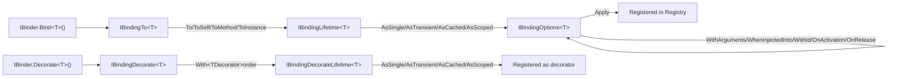

# Fluent Binder API

Namespace: `SimplEnteiner.Core.Binder.Interfaces` (public contracts), `SimplEnteiner.Core.Binder.Implementations` (internal implementations)
Sources: [`Core/Binder/Interfaces/`](../../SimplEnteiner/Core/Binder/Interfaces), [`Core/Binder/Implementations/`](../../SimplEnteiner/Core/Binder/Implementations)

This is the primary public API surface used to register services. Every step returns a narrower interface, guiding the caller through: **target** → **implementation** → **lifetime** → **options** → **apply**.



## `IBinder`

```csharp
public interface IBinder
{
    IBindingTo<T> Bind<T>();
    IBindingTo Bind(Type interfaceType);
    IBindingDecorate<TService> Decorate<TService>();
    IBindingDecorate Decorate(Type interfaceType);
    void BindConvention(Action<IConventionBuilder> configure);
}
```

Implemented by `DIContainer` and `Scope`. This is the interface consumers primarily interact with — the entry point of every binding.

## `IBindingTo<TInterface>` / `IBindingTo`

```csharp
public interface IBindingTo<TInterface>
{
    IBindingLifetime<TInterface> To<TImplementation>() where TImplementation : TInterface;
    IBindingLifetime<TInterface> ToSelf();
    IBindingLifetime<TInterface> ToMethod(Func<TInterface> factory);
    IBindingLifetime<TInterface> ToInstance(TInterface instance);
}
```

| Method | Behavior |
|---|---|
| `To<TImplementation>()` | Binds `TInterface` to a concrete `TImplementation`. Compile-time constrained: `TImplementation : TInterface`. |
| `ToSelf()` | Binds `TInterface` to itself as implementation (only valid/useful when `TInterface` is itself instantiable, e.g. binding a concrete class to itself). |
| `ToMethod(Func<TInterface>)` | Binds to a factory delegate invoked on every resolution requiring a new instance (subject to lifetime caching). Throws `ArgumentNullException` if `factory` is `null`. |
| `ToInstance(TInterface instance)` | Binds to an already-constructed instance. Internally forces the registration's lifetime to `Singleton` regardless of a later `.AsX()` call (see `Registry.CreateRegistration`: `if (instance != null) lifeTime = LifeTime.Singleton;`). Throws `ArgumentNullException` if `instance` is `null`. |

```csharp
container.Bind<IGreeter>().To<Greeter>().AsSingle().Apply();
container.Bind<IClock>().ToMethod(() => new SystemClock(DateTimeOffset.UtcNow)).AsTransient().Apply();
container.Bind<IConfig>().ToInstance(new AppConfig { Env = "prod" }).AsSingle().Apply(); // instance forces Singleton anyway
```

The non-generic `IBindingTo` mirrors all four members using `Type`/`object` instead of generics — useful for reflection-driven or convention-based registration.

## `IBindingLifetime<TInterface>` / `IBindingLifetime`

```csharp
public interface IBindingLifetime<TInterface>
{
    IBindingOptions<TInterface> AsSingle();
    IBindingOptions<TInterface> AsTransient();
    IBindingOptions<TInterface> AsCached();
    IBindingOptions<TInterface> AsScoped();
}
```

Maps directly to the four [`LifeTime`](./lifecycle.md#lifetime) values. See [Scopes, Lifetimes and Disposal](../core/scopes-and-lifetimes.md) for exact semantics of each.

## `IBindingOptions<TInterface>` / `IBindingOptions`

```csharp
public interface IBindingOptions<TInterface>
{
    IBindingOptions<TInterface> WithArguments(params object[] args);
    IBindingOptions<TInterface> WhenInjectedInto<T>();
    IBindingOptions<TInterface> WithId(object id);
    IBindingOptions<TInterface> OnActivation(Action<TInterface> onActivation);
    IBindingOptions<TInterface> OnRelease(Action<TInterface> onRelease);
    void Apply();
}
```

| Method | Behavior |
|---|---|
| `WithArguments(params object[] args)` | Supplies extra constructor arguments that are matched **by assignable type** against the implementation's constructor parameters (see `Resolver.ResolveConstructorWithArguments`); parameters not satisfied by an argument are resolved normally from the container. |
| `WhenInjectedInto<T>()` | Registers this binding as **conditional**: it is only used when the interface is being injected as a dependency of `T` (matched via `ResolutionContext.RequestType` during constructor/member parameter resolution). Mutually exclusive in practice with `WithId` — internally both route into the same `ConditionalBindings` dictionary keyed by `(InterfaceType, Id ?? ConditionType)`. |
| `WithId(object id)` | Registers this binding as conditional, keyed by an explicit `id` object instead of a consumer type. Resolved via `Resolve<T>(id)`/`Resolve(Type, id)` or automatically when a constructor parameter/field/property is marked with `[Id(id)]` (see [Attributes and Delegates](./attributes-delegates.md)). |
| `OnActivation(Action<TInterface>)` | Callback invoked immediately after the instance is constructed and member-injected (before being returned to the caller). Runs on every activation (i.e. every time a **new** instance is created, not on cache/singleton/scoped hits). |
| `OnRelease(Action<TInterface>)` | Callback invoked when the instance is disposed by the owning `CleanupService`/`RepositoryService` (invoked before `Dispose()`/`DisposeAsync()` is called on the instance itself, if it implements `IDisposable`/`IAsyncDisposable`). |
| `Apply()` | Finalizes the staged builder (`BindingBuilder.ExecuteAllStages()`) and registers it into the target's `Registry`. **Required** unless `Build()` is called later (which flushes any un-applied pending bindings automatically). |

```csharp
container.Bind<IRepository>()
    .To<SqlRepository>()
    .AsScoped()
    .WithArguments("Server=.;Database=App;")
    .OnActivation(r => Console.WriteLine($"{r.GetType().Name} activated"))
    .OnRelease(r => Console.WriteLine($"{r.GetType().Name} released"))
    .Apply();
```

## `IBindingDecorate<TInterface>` / `IBindingDecorate`

```csharp
public interface IBindingDecorate<TInterface>
{
    IBindingDecorateLifetime<TInterface> With<TImplementation>(int? order = null) where TImplementation : TInterface;
}
```

Starts a decorator registration for `TInterface`. `order` controls the wrapping order when multiple decorators target the same interface (lower `order` wraps first / closer to the base implementation — decorators are applied in ascending `Order`, see `Registry.AddDecorator`'s binary-insert-by-order logic). If `order` is omitted, it defaults to `0` for the first decorator and `previous.Order + 1` for subsequent ones.

For the non-generic `IBindingDecorate.With(Type implementation, int? order = null)`, `BindingDecorate.Validate` enforces that `implementation` is actually compatible with the target interface (handles exact, closed-generic, and open-generic-definition interface shapes), throwing `InvalidOperationException` otherwise.

## `IBindingDecorateLifetime<TInterface>` / `IBindingDecorateLifetime`

```csharp
public interface IBindingDecorateLifetime<TInterface>
{
    void AsSingle();
    void AsTransient();
    void AsCached();
    void AsScoped();
}
```

Unlike the main binding pipeline, each of these methods **implicitly applies** the registration (`Apply()` is called internally right after `SetLifetime`) — there is no separate `.Apply()` step for decorators. See [Decorators](../core/decorators.md) for full semantics including generic decorator resolution.

```csharp
container.Decorate<IGreeter>().With<LoggingGreeterDecorator>(order: 0).AsTransient();
container.Decorate<IGreeter>().With<CachingGreeterDecorator>(order: 1).AsSingle();
```

## `BindingBuilder` (internal engine, public class)

Namespace: `SimplEnteiner.Core.Binder`
Source: [`Core/Binder/BindingBuilder.cs`](../../SimplEnteiner/Core/Binder/BindingBuilder.cs)

While consumers never construct a `BindingBuilder` directly (it is created internally by `Bind<T>()`/`Decorate<T>()`), it is a `public` class because it flows through `internal`-visible integration points and is useful to understand for advanced scenarios (custom `IScopeFactory`/`IRegistryFactory` implementations, diagnostics). Key public members:

```csharp
public Type InterfaceType { get; }
public Type ImplementationType { get; }
public Func<object> FactoryMethod { get; }
public object Instance { get; }
public LifeTime LifeTime { get; }
public List<object> Arguments { get; }
public Type ConditionType { get; }
public object Id { get; }
public int? Order { get; }
public Action<object> OnActivation { get; }
public Action<object> OnRelease { get; }
public bool IsComplete { get; }     // true once the FinalStage has been reached
public bool IsRegistered { get; }   // true once registered in a Registry (prevents double-registration)
```

Its `Set*` methods (`SetImplementation`, `SetFactoryMethod`, `SetInstance`, `SetLifetime`, `SetCondition`, `SetId`, `SetOnActivation`, `SetOnRelease`, `AddDecorator`) are the low-level operations that the fluent `Binder.Implementations` classes call; each transition is validated against the internal `BuilderStateMachine` (see [Design Patterns → Fluent Builder + Finite State Machine](../architecture/design-patterns.md#fluent-builder--finite-state-machine)) and throws `InvalidOperationException` if called out of order (e.g., setting the implementation twice).

Continue to [Registration and Resolution](./registration-resolution.md).
