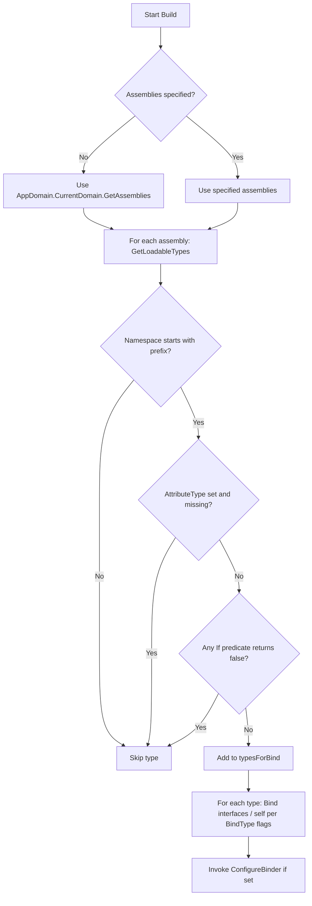

# Convention-Based Binding

Namespace: `SimplEnteiner.Core.ConventionBinding.Interfaces` / `SimplEnteiner.Core.ConventionBinding.Implementations`
Source: [`Core/ConventionBinding/Interfaces/IConventionBuilder.cs`](../../SimplEnteiner/Core/ConventionBinding/Interfaces/IConventionBuilder.cs), [`Core/ConventionBinding/Implementations/ConventionBuilder.cs`](../../SimplEnteiner/Core/ConventionBinding/Implementations/ConventionBuilder.cs)

Convention-based binding lets you register many services at once by scanning assemblies for types matching a set of filters, instead of writing an explicit `Bind<T>()` call for each one.

## `IConventionBuilder`

```csharp
public interface IConventionBuilder
{
    IConventionBuilder If(Func<Type, bool> predicate);
    IConventionBuilder FromAssembly(Assembly assembly);
    IConventionBuilder FromAssemblies(params Assembly[] assemblies);
    IConventionBuilder InNamespace(string namespacePrefix);
    IConventionBuilder WithAttribute<TAttribute>() where TAttribute : Attribute;
    IConventionBuilder BindInterfaces();
    IConventionBuilder BindSelf();
    IConventionBuilder As(LifeTime lifetime);
    void Configure(Action<IBinder> registration);
}
```

| Method | Effect |
|---|---|
| `FromAssembly(Assembly)` / `FromAssemblies(params Assembly[])` | Restricts scanning to the given assemblies. If none are specified, **all currently loaded `AppDomain.CurrentDomain` assemblies** are scanned (`ConventionBuilder.Build()`). Calling `FromAssembly` twice with the same assembly throws `ArgumentException`. |
| `InNamespace(string prefix)` | Only considers types whose `Namespace` starts with `prefix` (`string.StartsWith`, ordinal). Passing `null` throws `ArgumentNullException`. Default is `string.Empty` (matches every namespace, including `null` namespaces guarded internally). |
| `WithAttribute<TAttribute>()` | Only considers types decorated with `TAttribute` (`GetCustomAttribute`, non-inherited lookup as coded). |
| `If(Func<Type,bool>)` | Adds an arbitrary additional predicate; can be called multiple times — a candidate type must satisfy **all** registered predicates (AND-combined). |
| `BindInterfaces()` | For each matched type, binds every interface it implements (`type.GetInterfaces()`) to that type. Flag can be combined with `BindSelf()`. |
| `BindSelf()` | For each matched type, binds the type to itself (`ToSelf()`). |
| `As(LifeTime)` | Sets the lifetime applied to all convention-generated bindings (default `LifeTime.Transient`). |
| `Configure(Action<IBinder>)` | An escape hatch: an additional callback invoked with the owning scope **after** all convention-derived bindings have been applied, letting you add manual bindings alongside the scanned ones. |

## Usage

```csharp
container.BindConvention(convention =>
{
    convention
        .FromAssembly(typeof(Program).Assembly)
        .InNamespace("MyApp.Services")
        .WithAttribute<ServiceAttribute>()
        .If(t => t.Name.EndsWith("Service"))
        .BindInterfaces()
        .BindSelf()
        .As(LifeTime.Scoped);
});
```

`DIContainer.BindConvention` / `Scope.BindConvention` both:

1. Create a new `ConventionBuilder(scope)`.
2. Invoke the caller's `configure` callback against it (throws `ArgumentNullException` if `configure` is `null`).
3. Call `builder.Build()`, which performs the scan-and-bind (see below), then invokes `ConfigureBinder` if one was set via `Configure(...)`.
4. On `DIContainer` specifically, also flushes any bindings still pending in `_pendingBindings` (`BuildPendings()`), so convention bindings + directly-created pending bindings are all registered together.

## Scanning Algorithm (`ConventionBuilder.Build()`)



Each qualifying type is bound with the configured `LifeTime` and immediately `.Apply()`-ed (see `ConventionBuilder.BindLifetime`), so convention bindings are registered eagerly during `Build()`, not deferred.

## Interaction with Validation

Because convention binding can register **interfaces without concrete implementations found** (e.g., an interface with zero or multiple matching implementations gets zero or multiple exact registrations — the last one wins per `Dictionary` overwrite semantics in `Registry.AddExactRegistration`), it's recommended to always follow up with `container.Build()` (which runs `Registry.ValidateAll()`) to catch any resulting resolution gaps early — see [Reachability Analysis and Validation](../core/reachability-analysis.md).

## `IInstaller` and `ScanAndInstall` (Modularization)

Source: [`Core/InstallerService/Interfaces/IInstaller.cs`](../../SimplEnteiner/Core/InstallerService/Interfaces/IInstaller.cs), [`Utilities/ContainerExtensions.cs`](../../SimplEnteiner/Utilities/ContainerExtensions.cs)

```csharp
public interface IInstaller
{
    void Install(IScope target);
}
```

An `IInstaller` is a reusable unit of registration logic — a natural companion to convention binding for splitting large registration graphs into modules:

```csharp
public class LoggingInstaller : IInstaller
{
    public void Install(IScope target)
    {
        target.Bind<ILogger>().To<ConsoleLogger>().AsSingle().Apply();
    }
}
```

Two extension methods (`ContainerExtensions.ScanAndInstall`) discover and invoke every concrete `IInstaller` implementation found in the given (or all loaded) assemblies:

```csharp
public static void ScanAndInstall(this DIContainer container, params Assembly[] assemblies);
public static void ScanAndInstall(this IScope scope, params Assembly[] assemblies);
```

Each discovered installer type is **resolved from the container** (`container.Resolve(type)`) before `Install` is invoked — meaning installer classes can themselves have injected dependencies (as long as those dependencies are already registered or are concrete classes). See the usage example in [`Core/BindExample.cs`](../../SimplEnteiner/Core/BindExample.cs) (`ProgramExample.Main`):

```csharp
DIContainer container = new DIContainer();
container.ScanAndInstall();
container.Build();
```

Continue to [`TypeAnalyzes` Reflection Toolkit](./type-analyzes.md).
