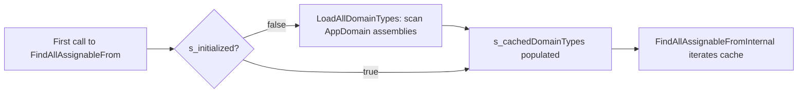

# `TypeAnalyzes` Reflection Toolkit

Namespace: `SimplEnteiner` (top-level, **not** under `SimplEnteiner.Core`)
Source: [`TypeAnalyzes.cs`](../../SimplEnteiner/TypeAnalyzes.cs), [`TypeAnalyzes.TypeCondition.cs`](../../SimplEnteiner/TypeAnalyzes.TypeCondition.cs)

```csharp
public static partial class TypeAnalyzes
```

`TypeAnalyzes` is a static partial class providing the reflection primitives that power the whole container (constructor selection, dependency graph walking, generic constraint checking), but it is designed and documented well enough to be used **independently** as a general-purpose type-introspection library.

> As the class's own XML doc states: *"Provides convenient methods for scanning the Types. Has heavy lazy initializable static cache about types."*

## Caching Model

- `s_cachedDomainTypes` — a lazily-populated, process-wide `List<Type>` of every loadable type from every assembly known to the cache. Populated on first use of `FindAllAssignableFrom` (via `LoadAllDomainTypes()`), which seeds it from `AppDomain.CurrentDomain.GetAssemblies()`.
- `s_assembliesCache` — the `HashSet<Assembly>` backing the above, to avoid re-scanning already-known assemblies.
- `s_injectableConstructorsCache` — `ConcurrentDictionary<Type, ConcurrentDictionary<Type, ConstructorInfo>>`, memoizing `GetInjectableConstructor` results per `(type, injectAttributeType)` pair.
- All cache access is guarded by a single `object s_lock` for the domain-types cache; the constructor cache uses lock-free `ConcurrentDictionary` operations.
- `ClearCache()` — public API to reset all caches (constructor cache, domain types, initialization flag). Useful in tests or after dynamically loading new assemblies you want re-scanned from scratch.
- `AddAssemblies(IEnumerable<Assembly>)` — public API to explicitly add assemblies to the domain cache **incrementally** without a full rescan, useful for assemblies loaded after the initial scan (e.g., plugins).



## Method Catalogue

| Method | Signature | Purpose |
|---|---|---|
| `FindAllNonAbstractClassAssignableFrom` | `IEnumerable<Type> FindAllNonAbstractClassAssignableFrom(this Type type, bool isGenericType = false)` | Shortcut for finding concrete, non-abstract classes assignable from `type`, optionally filtering to generic or non-generic types only. |
| `FindAllAssignableFrom(Type, TypeCondition)` | `IEnumerable<Type> FindAllAssignableFrom(this Type type, TypeCondition condition)` | Finds all assignable types whose combined `Type.Is*` flag set (as `TypeCondition`) matches `condition` (bitwise `AND` containment). |
| `FindAllAssignableFrom(Type, params Func<Type,bool>[])` | `IEnumerable<Type> FindAllAssignableFrom(this Type type, params Func<Type, bool>[] additionAndPredicates)` | Most general overload: all assignable types (or all types matching an open generic definition) satisfying every supplied predicate (AND-combined). Throws `ArgumentNullException` if `type` is `null`. |
| `GetLoadableTypes` | `IEnumerable<Type> GetLoadableTypes(this Assembly assembly)` | Safely enumerates every type (including nested types, recursively) in an assembly, swallowing `ReflectionTypeLoadException` by falling back to the successfully-loaded subset, and swallowing any other exception by returning empty. |
| `IsConcreteClass` | `bool IsConcreteClass(this Type type, bool isIgnoreGeneratedType = false)` | True if `type` is a class, not abstract, not an interface, not an open generic definition, has at least one public instance constructor, and (optionally) is not compiler-generated. |
| `IsAssignableToGenericTypeDefinition` | `bool IsAssignableToGenericTypeDefinition(this Type type, Type genericTypeDefinition)` | True if `type` implements/derives from the open generic definition `genericTypeDefinition` (walks interfaces and base-type chain). |
| `GetAssignableToGenericArguments` | `Type[] GetAssignableToGenericArguments(this Type type, Type genericTypeDefinition)` | Returns the closed generic arguments `type` uses to satisfy `genericTypeDefinition`, or `Type.EmptyTypes` if not assignable. |
| `GetTypesWithAttribute<TAttribute>` | `IEnumerable<Type> GetTypesWithAttribute<TAttribute>(this Assembly assembly, bool isInherit = false)` | All loadable types in `assembly` decorated with `TAttribute`. |
| `GetInjectableConstructor` | `ConstructorInfo? GetInjectableConstructor(this Type type, Type injectAttributeType)` | Cached lookup: the single constructor marked with `injectAttributeType`, or (if none marked) the public constructor with the most parameters. Throws if multiple constructors are marked. Returns `null` if there are no public constructors. |
| `GetDependencyType` | `Type GetDependencyType(this ParameterInfo parameterInfo)` | Equivalent to `parameterInfo.ParameterType.GetUnderlyingDependencyType()`. |
| `GetFactoryMethod` | `Func<object[], object> GetFactoryMethod(this ConstructorInfo constructor)` | Compiles (via `System.Linq.Expressions`) a fast factory delegate for `constructor`; falls back to `constructor.Invoke(args)` on compilation failure (e.g., AOT/IL2CPP). |
| `GetInjectableMembers` | `IEnumerable<MemberInfo> GetInjectableMembers(this Type type, Type injectAttribute)` | All public/non-public instance fields, properties, and methods marked with `injectAttribute`. |
| `MatchesGenericParameters` | `bool MatchesGenericParameters(this Type[] args, Type[] constraints)` | True if every `args[i]` is assignable to `constraints[i]` and lengths match. |
| `GetAllDependencies` | `HashSet<Type> GetAllDependencies(this Type type, Type injectAttribute, Func<Type,Type> resolver = null)` | Iteratively (stack-based, not recursive) walks the full transitive constructor + member dependency graph of `type`, returning every distinct dependency type encountered (excluding `type` itself). An optional `resolver` can remap a dependency type before it's added/traversed (e.g., interface → concrete implementation). |
| `HasCyclicDependencies` | `bool HasCyclicDependencies(this Type type, Type injectAttribute, out List<Type> cyclePath)` | Recursive DFS cycle detection over the same dependency graph; `cyclePath` is populated with the offending cycle (ending back at `type`) when `true` is returned. |
| `AddAssemblies` | `void AddAssemblies(IEnumerable<Assembly> assemblies)` | Incrementally registers additional assemblies into the domain-types cache. |
| `GetUnderlyingDependencyType` | `Type GetUnderlyingDependencyType(this Type type)` | Unwraps `T[]`, `IEnumerable<T>`, `Lazy<T>`, `Func<T>` down to `T`; returns `type` unchanged otherwise. |
| `SatisfiesOpenedGenericConstraints` | `bool SatisfiesOpenedGenericConstraints(this Type type, Type openDefinition)` | True if `type`'s generic arguments (for the first matching implemented open interface) satisfy that interface's own generic parameter constraints. |
| `SatisfiesClosedGenericConstraints` | `bool SatisfiesClosedGenericConstraints(this Type type, Type closedGenericDefinition)` | True if `type` implements the exact closed generic `closedGenericDefinition` and its generic-parameter constraints are satisfied. Throws `ArgumentException` if `closedGenericDefinition` is not actually a closed generic type. |
| `GetMarkedConstructors` | `ConstructorInfo[] GetMarkedConstructors(this Type type, Type injectAttribute)` | All constructors (not just public) marked with `injectAttribute` — unlike `GetInjectableConstructor`, does not throw on multiple matches and does not fall back to the greediest constructor. |
| `IsOptionalParameter` | `bool IsOptionalParameter(this ParameterInfo parameter)` | True if the parameter is `[Optional]` or has a default value. |
| `GetMemberDependencyType` | `Type[] GetMemberDependencyType(this MemberInfo member)` | For a `FieldInfo`/`PropertyInfo`, returns a single-element array with its type; for a `MethodInfo`, returns all parameter types; otherwise an empty array. |
| `CanResolveAllDependencies<T>` | `bool CanResolveAllDependencies<T>(this Type type, Type injectAttribute, IReadOnlyDictionary<Type,T> dependencyRegistryMap, Func<T,Type> selector, Func<Type,Type> resolver = null)` | True if every transitive dependency of `type` is either a concrete class or present in `dependencyRegistryMap`. Throws `CircularDependencyException` if a cycle exists. |
| `ClearCache` | `void ClearCache()` | Resets all static caches. |

## `TypeCondition` Flags Enum

Source: [`TypeAnalyzes.TypeCondition.cs`](../../SimplEnteiner/TypeAnalyzes.TypeCondition.cs)

```csharp
[Flags]
public enum TypeCondition : long
{
    None = 0,
    Abstract = 1L << 0,
    AnsiClass = 1L << 1,
    Array = 1L << 2,
    // ... 46 flags total, one per relevant System.Type.Is* boolean property
    ConstructedGenericType = 1L << 45,
}
```

A comprehensive bit-flag mirror of nearly every `System.Type.Is*` boolean property (`IsAbstract`, `IsClass`, `IsGenericType`, `IsPublic`, `IsSealed`, `IsValueType`, `IsNested*`, etc. — see the full list in the source file and its XML doc comments), enabling composite queries like:

```csharp
var candidates = typeof(IPlugin).FindAllAssignableFrom(TypeCondition.Class | TypeCondition.Public);
```

`GetFlag(Type)` (private) computes the applicable `TypeCondition` combination for a given `Type` by checking each `Is*` property once. Note that `TypeCondition.Serializable` is annotated `[Obsolete]` since it mirrors the now-deprecated `Type.IsSerializable` property.

## Standalone Usage Example

Because `TypeAnalyzes` has no dependency on any other SimplEnteiner type besides the `CircularDependencyException` it defines, it can be used purely as a reflection utility library:

```csharp
using SimplEnteiner;

IEnumerable<Type> plugins = typeof(IPlugin)
    .FindAllNonAbstractClassAssignableFrom()
    .Where(t => t.GetCustomAttribute<PluginAttribute>() != null);

foreach (Type pluginType in plugins)
{
    var ctor = pluginType.GetInjectableConstructor(typeof(InjectAttribute));
    var factory = ctor.GetFactoryMethod();
    // ...
}
```

Continue to [MS.DI Integration API](./ms-di-integration.md).
