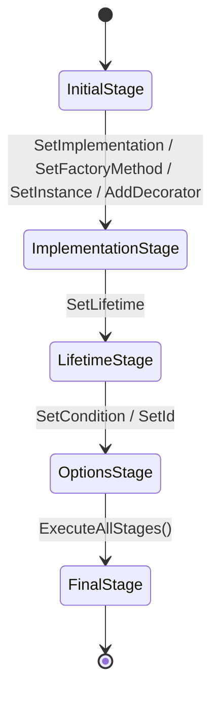

# Design Patterns Used

SimplEnteiner makes deliberate use of several classic design patterns. This page documents where each pattern is applied and why.

## Fluent Builder + Finite State Machine

**Where:** [`Core/Binder/BindingBuilder.cs`](../../SimplEnteiner/Core/Binder/BindingBuilder.cs), [`Core/Binder/BuilderStages`](../../SimplEnteiner/Core/Binder/BuilderStages)

Each call to `Bind<T>()` creates a `BindingBuilder`, which is driven by an internal `BuilderStateMachine` through five ordered stages:

Each `Stage` (`InitialStage`, `ImplementationStage`, `LifetimeStage`, `OptionsStage`, `FinalStage`) has a numeric `Id` used to detect illegal backward transitions (`BindingBuilder.ThrowIfCantTransit<T>`), e.g. calling `SetLifetime` twice throws `InvalidOperationException("Lifetime already set!")`. When a stage is skipped (e.g. the caller does not explicitly call `AsTransient()`), `BuilderStateMachine.ExecuteTo<TStage>()` executes the *default* behavior of every skipped stage (see `LifetimeStage.OnExecuteBinding` which defaults to `LifeTime.Transient`, and `ImplementationStage.OnExecuteBinding` which defaults implementation to `ToSelf()`).

This guarantees that every `BindingBuilder`, regardless of how many fluent calls were made, ends up fully configured before being registered into the `Registry`.

The public fluent surface itself (`IBindingTo` → `IBindingLifetime` → `IBindingOptions`) is a classic **step builder** / fluent interface pattern that narrows the set of valid next calls at each stage — see [API Reference → Binder](../api/binder.md).

## Facade

**Where:** [`Core/DIContainer.cs`](../../SimplEnteiner/Core/DIContainer.cs)

`DIContainer` is a facade over `Scope`: nearly every public member simply forwards to `_rootScope`. This keeps the *public* entry point stable and simple while all the actual logic (registration, resolution, disposal, hierarchical scoping) is implemented once in `Scope` and reused for both the root container and every child scope (which are plain `Scope` instances, not `DIContainer` instances).

## Composite (Scope Tree)

**Where:** [`Core/ScopeFeature/Scope.cs`](../../SimplEnteiner/Core/ScopeFeature/Scope.cs)

Scopes form a tree: `Scope.CreateScope()` creates a child `Scope` with the same `ScopeCreationConfig` (shared `IResolver`, `IScopeFactory`, `IRegistryFactory`, singleton repository) but its own `Registry` and scoped-instance dictionary. Operations like `Build()`, `AnalyzeReachability(...)`, and `GetAllExactRegistration()` recursively traverse this tree (parent-first or child-first depending on the operation), which is the essence of the Composite pattern.

## Strategy

**Where:** `IResolver`, `IRegistryFactory`, `IScopeFactory` (all injected via [`ScopeCreationConfig`](../../SimplEnteiner/Core/ScopeFeature/ScopeCreationConfig.cs))

The concrete resolution algorithm (`Resolver`), the registry storage implementation (`RegistryFactory` → `Registry`), and the child-scope creation strategy (`DefaultScopeFactory`) are all pluggable via interfaces injected into `ScopeCreationConfig`. Although `DIContainer` currently wires up only the default implementations (`ConfigureConfig` in `DIContainer.cs`), the seams exist for consumers or tests to substitute alternative strategies.

## Decorator

**Where:** [`Core/Binder/Interfaces/IBindingDecorate.cs`](../../SimplEnteiner/Core/Binder/Interfaces/IBindingDecorate.cs), [`Core/RegistrationService/DecoratorRegistration.cs`](../../SimplEnteiner/Core/RegistrationService/DecoratorRegistration.cs), `Resolver.ResolveDecorators`

The library implements the GoF Decorator pattern as a first-class DI feature: `Decorate<TService>().With<TDecorator>(order).AsScoped()` registers a decorator that the `Resolver` wraps around the base implementation at resolution time, in ascending `Order`. Multiple decorators can be stacked; open-generic decorators are supported for open-generic services (`interfaceType.IsGenericTypeDefinition`).

## Factory Method / Compiled Expression Factories

**Where:** `TypeAnalyzes.GetFactoryMethod(ConstructorInfo)`

Instead of calling `Activator.CreateInstance` (which is comparatively slow and reflection-heavy on every resolution), SimplEnteiner compiles a `Expression.Lambda<Func<object[], object>>` once per constructor and caches/reuses the compiled delegate. This is a Factory Method pattern implemented via expression trees, with a defensive `try/catch` fallback to `constructor.Invoke(args)` for environments where JIT-compiling expression trees is unavailable (e.g., IL2CPP/AOT platforms), as explicitly called out in the XML doc comment.

## Specification / Predicate Composition

**Where:** [`Core/ConventionBinding/Implementations/ConventionBuilder.cs`](../../SimplEnteiner/Core/ConventionBinding/Implementations/ConventionBuilder.cs)

`IConventionBuilder.If(Func<Type,bool>)`, `.InNamespace(...)`, `.WithAttribute<T>()` compose a set of predicates that are AND-combined (`_ifPredicates.Any(p => p(type) == false)`) to filter candidate types before binding them — a lightweight Specification-pattern style composition.

## Template Method (Lifecycle Hooks)

**Where:** [`Core/Lifecycle/IInitializable.cs`](../../SimplEnteiner/Core/Lifecycle/IInitializable.cs), `IAsyncInitializable`, `IStartable`, and `InterfaceInvoker`

Consumers implement well-known lifecycle interfaces on their own classes; the `Resolver` (for `IInitializable`/`IAsyncInitializable`) and `Scope.Start()` (for `IStartable`, singleton-only) invoke them automatically at the appropriate point in an instance's life — a Template-Method-flavored extension point.

## Serializer / Data Transfer Object

**Where:** [`Core/Configuration`](../../SimplEnteiner/Core/Configuration) (`ScopeConfig`, `BindingConfig`, `DecoratorConfig`) and the nested `Scope.Serializer` / `DIContainer.Serializer` classes

Registrations are converted to/from plain serializable DTOs using `System.Text.Json`, decoupling the live object graph (`Registration`, `DecoratorRegistration`, which hold live `Func<object[],object>` delegates and `Type` references) from a wire/storage format (assembly-qualified type name strings, JSON-encoded instances/arguments). See [Core Functionality → Serialization](../core/serialization.md).

## Adapter

**Where:** [`Integrations/MS_DI/SimplEnteinerServiceProvider.cs`](../../SimplEnteiner/Integrations/MS_DI/SimplEnteinerServiceProvider.cs), `SimplEnteinerServiceScope.cs`

`SimplEnteinerServiceProvider` adapts `IScope` to the `Microsoft.Extensions.DependencyInjection` abstractions `IServiceProvider`, `ISupportRequiredService`, and `IServiceScopeFactory`. This lets any framework or library coded against the standard MS.DI abstractions consume a SimplEnteiner container transparently. See [Architecture → DI Integration](./di-integration.md).

Continue to [Namespace Structure](./namespaces.md).
