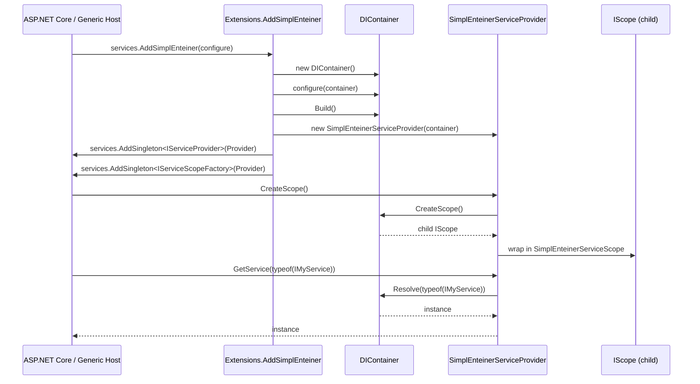

# Dependency Injection Integration

SimplEnteiner is itself a DI container, but it also plugs into `Microsoft.Extensions.DependencyInjection` (MS.DI) so it can be used as the backing container for ASP.NET Core, Generic Host, or any framework that consumes `IServiceProvider`/`IServiceScopeFactory`.

Source: [`Integrations/MS_DI/`](../../SimplEnteiner/Integrations/MS_DI)

## Registration Entry Point

```csharp
using Microsoft.Extensions.DependencyInjection;
using SimplEnteiner.Core;
using SimplEnteiner.Integrations.MS_DI;

IServiceCollection services = new ServiceCollection();

services.AddSimplEnteiner(container =>
{
    container.Bind<IGreeter>().To<Greeter>().AsSingle().Apply();
    container.Bind<IClock>().To<SystemClock>().AsScoped().Apply();
});
```

`Extensions.AddSimplEnteiner` (see [`Extensions.cs`](../../SimplEnteiner/Integrations/MS_DI/Extensions.cs)):

```csharp
public static IServiceCollection AddSimplEnteiner(this IServiceCollection services, Action<DIContainer> configure)
{
    DIContainer container = new DIContainer();
    configure.ThrowIfArgumentNull().Invoke(container);
    container.Build();

    services.AddSingleton<IServiceProvider>(new SimplEnteinerServiceProvider(container));
    services.AddSingleton<IServiceScopeFactory>(new SimplEnteinerServiceProvider(container));

    return services;
}
```

Behavior notes:

- A brand-new `DIContainer` is created, configured synchronously via the `configure` callback, then immediately `Build()`-ed — meaning all validation (dependency graph resolvability, generic constraint checks) happens **before** returning from `AddSimplEnteiner`, so misconfiguration surfaces immediately at startup rather than lazily at first resolution.
- Both `IServiceProvider` and `IServiceScopeFactory` are registered as singletons pointing to the **same** `SimplEnteinerServiceProvider` instance (which implements both interfaces plus `ISupportRequiredService`).
- This call does **not** remove or interact with any services already registered directly on the `IServiceCollection` via `services.AddSingleton<T>()` etc. — it purely adds an `IServiceProvider`/`IServiceScopeFactory` pair. Whether the host actually uses this custom provider depends on the hosting infra (e.g. `UseServiceProviderFactory` in ASP.NET Core) — SimplEnteiner does not attempt to hijack `IServiceCollection` internals.

## `SimplEnteinerServiceProvider`

[`SimplEnteinerServiceProvider.cs`](../../SimplEnteiner/Integrations/MS_DI/SimplEnteinerServiceProvider.cs) implements three MS.DI interfaces over a wrapped `IScope`:

```csharp
public class SimplEnteinerServiceProvider : IServiceProvider, ISupportRequiredService, IServiceScopeFactory
{
    public object GetService(Type serviceType) => _container.Resolve(serviceType);

    public object GetRequiredService(Type serviceType) =>
        _container.Resolve(serviceType) ?? throw new InvalidOperationException($"Service {serviceType} not registered.");

    public IServiceScope CreateScope() => new SimplEnteinerServiceScope(_container.CreateScope());
}
```

- `GetService` simply forwards to `IScope.Resolve(Type)`. Any exception raised inside the SimplEnteiner resolution pipeline (e.g. "No binding found for X") propagates unchanged — MS.DI's `GetService` contract nominally expects `null` for unresolvable *optional* services, so callers relying on graceful `null` returns for unregistered types should be aware SimplEnteiner throws instead for types that are not concrete classes and have no binding (see [Resolution Workflow](../core/resolution-workflow.md)).
- `CreateScope()` delegates to `IScope.CreateScope()`, producing a genuine hierarchical **child scope** (not just an MS.DI-style logical scope) — singletons remain shared with the root, scoped services get fresh instances per created scope, exactly matching SimplEnteiner's own scope semantics.

## `SimplEnteinerServiceScope`

[`SimplEnteinerServiceScope.cs`](../../SimplEnteiner/Integrations/MS_DI/SimplEnteinerServiceScope.cs) wraps a child `IScope` inside a new `SimplEnteinerServiceProvider` and exposes it via the standard `IServiceScope.ServiceProvider` property. Disposing the `IServiceScope` disposes the underlying provider (if disposable), which in turn is expected to be released by the owning scope's lifetime management.

## Integration Diagram



## Limitations of the Current Integration

- There is no automatic translation of services already registered on the `IServiceCollection` (via `AddSingleton`, `AddScoped`, etc.) into SimplEnteiner bindings — all bindings must be configured explicitly inside the `configure` callback passed to `AddSimplEnteiner`.
- `IServiceProviderIsService` and other newer MS.DI diagnostic interfaces are not implemented.
- Keyed services (`IServiceCollection` keyed registration APIs) are not directly mapped; SimplEnteiner's own `WithId(...)`/`[Id]` mechanism is a related but separate concept (see [API Reference → Attributes and Delegates](../api/attributes-delegates.md)).

Continue to [API Reference → Container and Scope](../api/container-and-scope.md).
