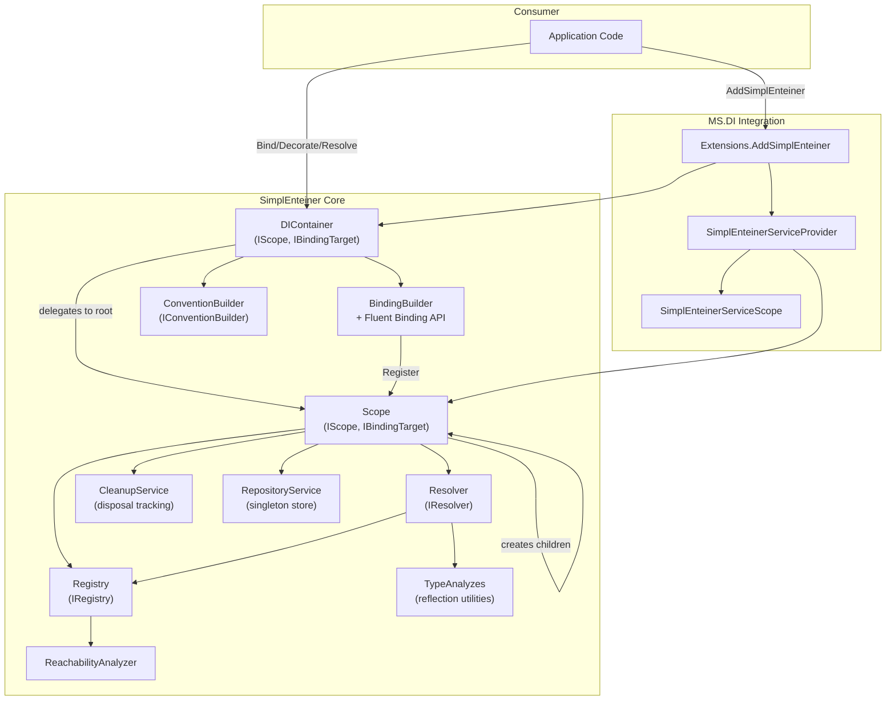
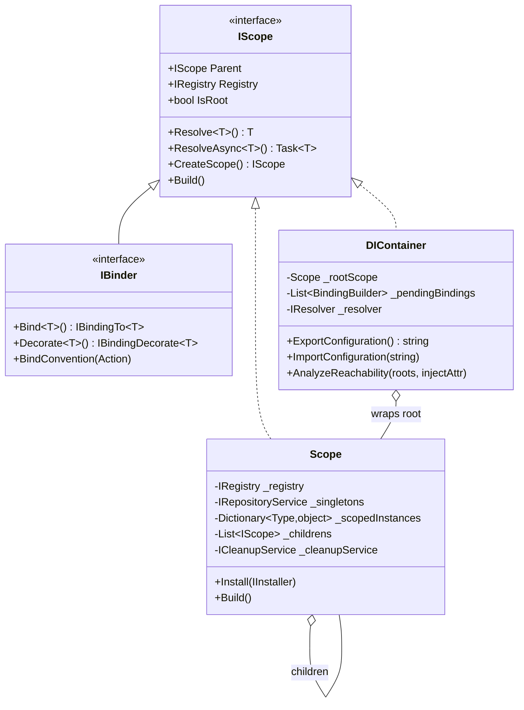

# Architecture Overview

## High-Level Diagram

## Layers

SimplEnteiner is organized into the following logical layers, all living under [`SimplEnteiner/Core`](../../SimplEnteiner/Core):

1. **Binder layer** (`Core/Binder`) — the public fluent API surface (`Bind<T>()`, `Decorate<T>()`) and the internal staged state machine (`BindingBuilder`, `BuilderStages`) that guarantees bindings are configured in a valid order and only registered once.
2. **Registration layer** (`Core/RegistrationService`) — the `Registry` that stores exact, open-generic, conditional, and decorator registrations, plus the validation logic that ensures a registration's dependencies are resolvable and its constraints are satisfied.
3. **Resolution layer** (`Core/ResolverService`) — the `Resolver`, which walks the constructor/member dependency graph, creates instances via compiled factory delegates, applies lifetime-specific caching/storage, and wraps instances with decorators.
4. **Scope layer** (`Core/ScopeFeature`) — `Scope`/`IScope`, the hierarchical container implementation that owns a `Registry`, a singleton repository, scoped instance dictionary, child scopes, and drives disposal.
5. **Lifecycle layer** (`Core/Lifecycle`) — lifetime enum, initialization/startup interfaces (`IInitializable`, `IAsyncInitializable`, `IStartable`), and the `CleanupService` that tracks `IDisposable`/`IAsyncDisposable` instances for correct teardown.
6. **Convention layer** (`Core/ConventionBinding`) — assembly-scanning, predicate/attribute/namespace-filtered auto-registration (`ConventionBuilder`).
7. **Configuration/Serialization layer** (`Core/Configuration`) — DTOs (`ScopeConfig`, `BindingConfig`, `DecoratorConfig`) used to serialize/deserialize a container's registration graph to/from JSON.
8. **Reflection toolkit** (`SimplEnteiner.TypeAnalyzes`, top-level namespace `SimplEnteiner`) — a large, independently reusable set of `Type`/`ConstructorInfo`/`MemberInfo` extension methods with a lazily-initialized, thread-safe, process-wide cache of loadable types.
9. **Analysis layer** (`SimplEnteiner.Analysis`) — `ReachabilityAnalyzer`, used to compute the set of types reachable from a set of "root" service types, used both by `Registry.AnalyzeReachability` and directly by consumers.
10. **Integration layer** (`SimplEnteiner.Integrations.MS_DI`) — adapters (`SimplEnteinerServiceProvider`, `SimplEnteinerServiceScope`, `Extensions.AddSimplEnteiner`) that expose a `DIContainer`/`IScope` as a standard `IServiceProvider`/`IServiceScopeFactory`.

## Root Container vs. Scope

`DIContainer` (public entry point, [`Core/DIContainer.cs`](../../SimplEnteiner/Core/DIContainer.cs)) is a thin façade over an internal root `Scope`. It implements both `IScope` (so it can be used anywhere an `IScope` is expected) and the internal `IBindingTarget` interface (used to receive registrations produced by the fluent binder). All actual bookkeeping — registry, singleton store, children, cleanup — lives in the `Scope` it wraps.

Continue to [Design Patterns](./design-patterns.md) for the rationale behind this structure, or to [Namespace Structure](./namespaces.md) for a file/namespace map.
