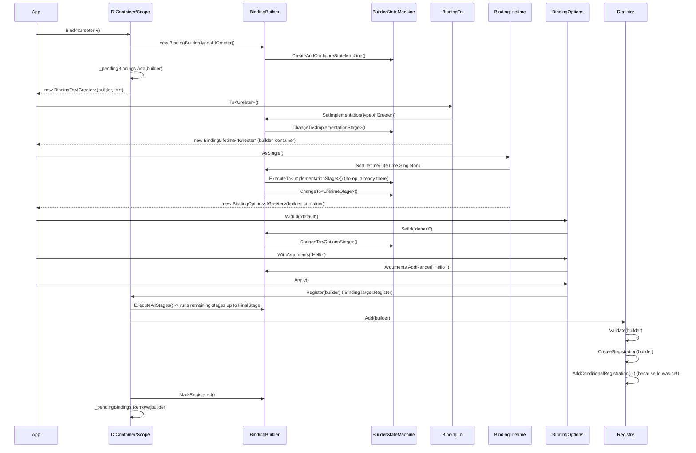

# Binding Workflow

This page walks through what happens, step by step, when you call the fluent binder API, tying together the [Design Patterns](../architecture/design-patterns.md#fluent-builder--finite-state-machine) discussion with concrete code paths.

## End-to-End Sequence

```csharp
container.Bind<IGreeter>()      // 1
    .To<Greeter>()              // 2
    .AsSingle()                 // 3
    .WithId("default")          // 4
    .WithArguments("Hello")     // 4
    .Apply();                   // 5
```



## Key Steps in Detail

1. **`Bind<TService>()`** creates a `BindingBuilder` for `typeof(TService)`, adds it to the owning container/scope's internal `_pendingBindings` list (thread-safe via a `lock`), and returns an `IBindingTo<TService>` wrapping both the builder and the owning `IBindingTarget` (the container/scope, accessed only through the internal interface — never exposed publicly).

2. Each fluent call (`To`, `AsSingle`, `WithId`, ...) mutates the same underlying `BindingBuilder` and advances (or validates against) its `BuilderStateMachine`. Calling a setter for a stage that has *already* been passed throws `InvalidOperationException` (e.g. `"Lifetime already set!"`), preventing accidental double-configuration.

3. **`Apply()`** (on `IBindingOptions`/`IBindingOptions<T>`) is the terminal step for a *non-decorator* binding. It calls the owning target's internal `Register(BindingBuilder)`:
   - `builder.ExecuteAllStages()` runs any stages not yet explicitly configured (defaulting `Lifetime` to `Transient` and `Implementation` to self, if the caller skipped those steps entirely — though in practice `Bind<T>().Apply()` alone without `.To(...)`/`.AsX(...)` is unusual, this exists as a safety net for programmatic/generated binding code).
   - `Registry.Add(builder)` validates and stores the resulting `Registration` in the appropriate bucket (`ExactBindings`, `OpenGenericBindings`, or `ConditionalBindings` — see [Registration and Resolution](../api/registration-resolution.md)).
   - `builder.MarkRegistered()` sets `IsRegistered = true`, and the builder is removed from `_pendingBindings`.

4. If `Apply()` is **never called** for a given `BindingBuilder` (a common pattern for decorator-less simple usage where a caller forgets it, or intentionally defers), the binding remains "pending." Calling `container.Build()` (or `BindConvention(...)` on `DIContainer`) flushes all pending bindings via `BuildPendings()`, registering each one exactly as `Apply()` would, and clearing the pending list. This makes `Build()` a safety net that guarantees no binding is silently lost, though relying on it instead of explicit `Apply()` calls is discouraged for readability.

   > Note: `Scope.Bind<T>()` (used for **child scopes**, as opposed to `DIContainer.Bind<T>()`) does **not** maintain its own pending list — bindings created directly on a child `Scope` must be explicitly `.Apply()`-ed; only `DIContainer` performs this pending/flush bookkeeping.

## Decorator Binding Workflow

Decorators follow a very similar builder pipeline but through a separate `Decorate<TService>()` entry point and `AddDecorator` builder mutation, and — critically — every lifetime-setting call (`AsSingle()`, `AsTransient()`, etc.) on `IBindingDecorateLifetime` **implicitly calls `Apply()`** (via `RegisterDecorator`, routed to `Registry.AddDecorator` instead of `Registry.Add`). See [Decorators](./decorators.md) for the full picture including resolution-time wrapping order.

## Validation Timing

Note that **binding-time validation** (`Registry.Add` → `Validate`) checks structural correctness immediately (implementation is concrete, assignable, has an injectable constructor, satisfies generic constraints) — but it does **not** verify that the implementation's *own* dependencies are resolvable yet, because other bindings might not be registered at that point (the commented-out check in `Registry.Add` explicitly notes this: *"Iterative validating maybe can invalid, if not all dependency registered in current time"*). Full dependency-graph validation happens later, in `Build()` → `ValidateAll()`. See [Core Functionality → Resolution Workflow](./resolution-workflow.md) and [Reachability Analysis and Validation](./reachability-analysis.md).

Continue to [Resolution Workflow](./resolution-workflow.md).
