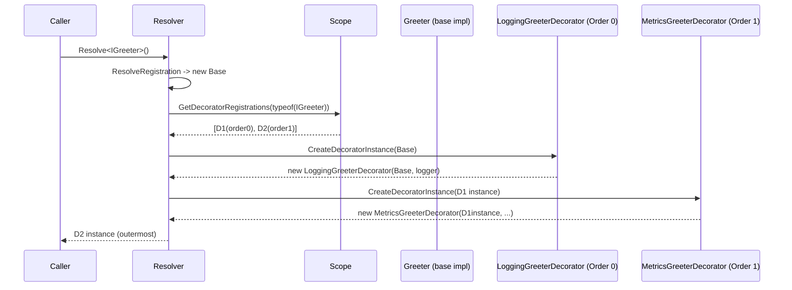

# Decorators

SimplEnteiner implements the Decorator design pattern as a native binding kind, distinct from regular service bindings, with its own storage bucket (`Registry.DecoratorBindings`) and its own resolution step (`Resolver.ResolveDecorators`), executed **after** the base service instance/registration has been produced.

## Registering Decorators

```csharp
container.Bind<IGreeter>().To<Greeter>().AsSingle().Apply();

container.Decorate<IGreeter>().With<LoggingGreeterDecorator>(order: 0).AsTransient();
container.Decorate<IGreeter>().With<MetricsGreeterDecorator>(order: 1).AsSingle();
```

A decorator implementation must have a constructor parameter assignable from the decorated interface (`IGreeter` in the example above) — this is enforced by `Registry.ValidateDecorator`:

```csharp
public class LoggingGreeterDecorator : IGreeter
{
    private readonly IGreeter _inner;
    private readonly ILogger _logger;

    [Inject]
    public LoggingGreeterDecorator(IGreeter inner, ILogger logger)
    {
        _inner = inner;
        _logger = logger;
    }

    public string Greet()
    {
        _logger.Log("Greeting requested");
        return _inner.Greet();
    }
}
```

Unlike regular bindings, `IBindingDecorateLifetime.AsSingle()`/`AsTransient()`/`AsCached()`/`AsScoped()` **implicitly call `Apply()`** — there is no separate step. See [Binder API → `IBindingDecorateLifetime`](../api/binder.md#ibindingdecoratelifetimetinterface--ibindingdecoratelifetime).

## Ordering

Decorators for the same interface are kept, per scope, in a `List<DecoratorRegistration>` sorted by ascending `Order` (via `ListExtensions.FindBinaryIndexMoreThan`, a binary-search insertion). If `order` is omitted when calling `.With<T>(order)`:

```csharp
decoratorRegistration.Order ??= decorators.Count == 0 ? 0 : decorators[^1].Order + 1;
```

— i.e., the first unordered decorator gets `0`, and each subsequent unordered decorator gets `previous.Order + 1`. Explicit orders can be interleaved with implicit ones as long as you're consistent about intent; ties are resolved by insertion position (binary search finds the first index whose existing order is *not* `<=` the new order).

## Resolution-Time Wrapping



`Resolver.ResolveDecorators` iterates the ordered decorator list and, for each entry:

1. If the decorator's own `Lifetime` is `Singleton` or `Scoped`, checks whether an instance for **that decorator type** already exists in the appropriate store (`GetSingleton`/`GetScoped` keyed by `decorator.DecoratorType`, not by the original interface type). If found, that existing decorator instance is used as-is (short-circuiting construction) — meaning singleton/scoped decorators are only ever constructed once, wrapping whichever base instance was current the first time.
2. Otherwise, `CreateDecoratorInstance` constructs a new decorator instance, passing the current `instance` as an additional constructor argument (matched by type, same mechanism as `.WithArguments(...)`, see `ResolveConstructorWithArguments`), then stores it per its own lifetime (`StoreDecorator`) and runs member injection + `IInitializable.Initialize()` on the **inner** instance being wrapped (note: `InjectMembers(instance, ...)` and `_invoker.Invoke<IInitializable>(instance)` are called with the pre-decoration `instance`, not the new decorator — see the source for the exact call sequence).
3. `instance` is reassigned to the newly created (or reused) decorator, becoming the input to the next decorator in the chain.

The final `instance` returned from `ResolveDecorators` is what the caller receives — a fully wrapped chain from innermost (the original `Registration`-produced service) to outermost (the highest-`Order` decorator).

## Generic and Open-Generic Decorators

Decorators also support open-generic definitions:

```csharp
container.Decorate(typeof(IRepository<>)).With(typeof(LoggingRepositoryDecorator<>)).AsSingle();
```

`Registry.AddDecorator` stores this under the **open generic definition** key (`typeof(IRepository<>)`). At resolution time, when a **closed** generic interface is being decorated, `Scope.GetDecoratorRegistrations` performs an extra pass (`AddGenericDecoratorRegistrations`) that looks up decorators registered against the open generic definition and, for each, closes the decorator's own generic type arguments using the requested interface's arguments (`registration.DecoratorType.MakeGenericType(arguments)`), producing an ad-hoc closed `DecoratorRegistration` for that specific resolution.

`BindingDecorate.Validate` (non-generic path) enforces three distinct compatibility rules depending on the shape of the interface being decorated:

- **Closed generic interface** (`IRepository<User>`) — the decorator implementation must be a concrete class satisfying the closed generic's constraints (`SatisfiesClosedGenericConstraints`).
- **Open generic interface** (`IRepository<>`) — the decorator implementation must itself be assignable to the open generic definition (`IsAssignableToGenericTypeDefinition`).
- **Non-generic interface** — a plain `IsAssignableFrom` check.

## Decorator Lookup Across the Scope Tree

`Scope.GetDecoratorRegistrations(interfaceType)` walks **from the current scope up to the root**, collecting decorator lists from *every* ancestor scope (in root-to-current order via `AddExactDecoratorRegistrations`'s reverse iteration of the collected scope list), so decorators registered at a parent scope apply to services resolved from a child scope as well — mirroring the same "child sees parent, not vice versa" rule used for regular registrations.

Continue to [Configuration Import/Export (Serialization)](./serialization.md).
