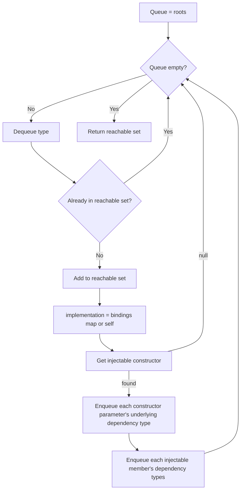

# Reachability Analysis and Validation

SimplEnteiner offers two related but distinct forms of "fail fast" validation for a container's dependency graph: **general validation** (always run as part of `Build()`) and **reachability analysis** (opt-in, targeted at "tree-shaking"-style dead-registration detection and stricter missing-binding detection from a known set of entry points).

## General Validation — `Registry.ValidateAll()`

Invoked automatically by `Scope.Build()` → `Scope.ValidateAll()` → `Registry.ValidateAll()` for every scope in the tree (root first, then children, per `Scope.Build()`'s recursive `_childrens[i].Build()` calls — though note `ValidateAll` itself is called once per scope inside that scope's own `Build()`, not cascaded from the parent's `ValidateAll`).

```csharp
public void ValidateAll()
{
    Type injectAttribute = Constants.InjectAttributeType;

    foreach (Type interfaceType in _exactBindings.Keys)
    {
        if (interfaceType.CanResolveAllDependencies(injectAttribute, _exactBindings, t => t.Implementation) == false)
            throw new InvalidOperationException($"Cannot resolve all dependencies of {interfaceType}.");
    }

    foreach (KeyValuePair<Type, Registration> pair in _openGenericBindings)
    {
        Type implementation = pair.Value.Implementation;

        if (implementation.IsConcreteClass(isIgnoreGeneratedType: true) == false)
            throw new InvalidOperationException($"Open generic implementation {implementation} for {pair.Key} is not a concrete class.");

        ConstructorInfo ctor = implementation.GetInjectableConstructor(injectAttribute)
            ?? throw new InvalidOperationException($"Open generic implementation {implementation} has no injectable constructor.");
    }
}
```

For every **exact** binding, `TypeAnalyzes.CanResolveAllDependencies` (see [`TypeAnalyzes` Reflection Toolkit](../api/type-analyzes.md)) is used to confirm that every transitive dependency is either:

- A concrete, injectable class (resolvable via the self-registration fallback), or
- Present as a key in `_exactBindings` (this scope's own bindings — note this check is **per-scope**, so a dependency satisfied only by a parent scope's registration would *not* be found by this specific check, since it only consults `_exactBindings` of the scope being validated, not the merged ancestor chain).

`CanResolveAllDependencies` also calls `HasCyclicDependencies` first and throws `TypeAnalyzes.CircularDependencyException` immediately if a cycle is detected — cyclic dependencies are treated as a validation failure, not silently tolerated.

For every **open generic** binding, the implementation must itself be concrete and expose an injectable constructor (its actual closed-generic dependency resolvability is deferred to resolution time, since it depends on which type arguments are ultimately requested).

## Reachability Analysis — `Registry.AnalyzeReachability` / `ReachabilityAnalyzer`

Source: [`Analysis/ReachabilityAnalyzer.cs`](../../SimplEnteiner/Analysis/ReachabilityAnalyzer.cs), `Registry.AnalyzeReachability` in [`Registry.cs`](../../SimplEnteiner/Core/RegistrationService/Registry.cs)

Unlike `ValidateAll()` (always run), reachability analysis is **opt-in** — you explicitly call `container.AnalyzeReachability(roots, injectAttribute)` with a set of "entry point" types (e.g., your top-level controllers, command handlers, or composition roots).

```csharp
container.AnalyzeReachability(
    roots: new[] { typeof(OrderController), typeof(PaymentController) },
    injectAttribute: typeof(InjectAttribute));
```

### `ReachabilityAnalyzer.ComputeReachability`

```csharp
public HashSet<Type> ComputeReachability(IEnumerable<Type> roots, IReadOnlyDictionary<Type, Type> bindings, Type injectAttribute)
```

A classic BFS over the dependency graph, starting from `roots`:



Note: `bindings` here maps `interfaceType → implementationType` and is populated from `_exactBindings` **only** — open-generic and conditional bindings are not included in the reachability graph exploration in the current implementation.

### `Registry.AnalyzeReachability` — Interpreting the Result

```csharp
public void AnalyzeReachability(IEnumerable<Type> roots, Type injectAttribute)
{
    Dictionary<Type, Type> allExact = _exactBindings.ToDictionary(...);
    HashSet<Type> reachable = ReachabilityAnalyzer.Instance.ComputeReachability(roots, allExact, injectAttribute);

    List<Type> unreachable = _exactBindings.Keys.Except(reachable).ToList();
    List<Type> missing = reachable.Where(t => allExact.ContainsKey(t) == false && t.IsConcreteClass() == false).ToList();

    // throws InvalidOperationException combining both lists, if either is non-empty
}
```

- **Unreachable services** — registrations that exist in `_exactBindings` but were never encountered while walking the dependency graph from `roots`. This flags "dead" registrations: bindings that nothing in your application actually depends on (directly or transitively) from the given entry points. This can indicate leftover/obsolete code, or — just as usefully — entry points you forgot to include in `roots`.
- **Missing bindings** — types that **are** reachable from `roots` but have **no** exact binding and are **not** themselves concrete/injectable classes (e.g., an interface with nothing bound to it). This is a stricter check than `ValidateAll()`'s per-registration dependency check, because it starts from real application entry points rather than only checking each registered type's own immediate dependencies.

Both lists, if non-empty, are combined into a single descriptive message and raised as `InvalidOperationException`.

## Recommended Usage Pattern

```csharp
DIContainer container = new DIContainer();

// ... all Bind<T>()...Apply() calls ...

container.Build(); // runs ValidateAll() per scope — catches missing/cyclic dependencies structurally

container.AnalyzeReachability(
    roots: EntryPointTypes,
    injectAttribute: typeof(InjectAttribute)); // optional, catches dead registrations + entry-point-driven missing bindings
```

Run both checks as part of your application's startup path (or, better, as part of an automated test — see [Testing and Quality Assurance](../testing.md)) so that configuration mistakes are caught before deployment rather than at first request.

Continue to [Configuration and Settings](../configuration.md).
