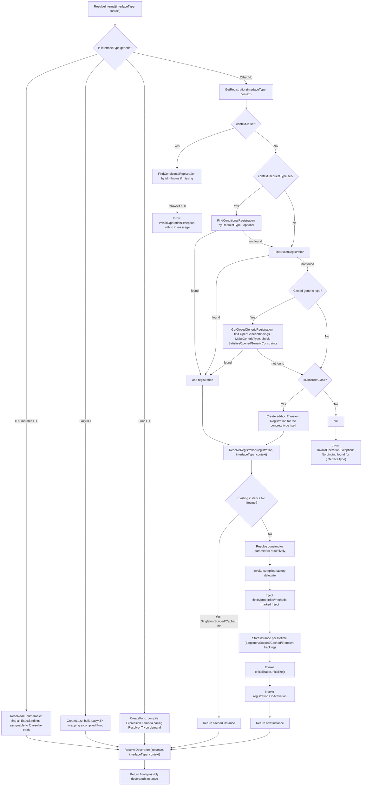

# Resolution Workflow

This page describes exactly what happens inside [`Resolver`](../../SimplEnteiner/Core/ResolverService/Resolver.cs) when `Resolve<T>()`/`Resolve(Type)` is called — the most complex single algorithm in the library.

## Top-Level Entry

```csharp
public object Resolve(Type interfaceType, Scope scope, object id = null)
{
    using ResolutionContext context = new ResolutionContext(scope, id);
    return ResolveInternal(interfaceType, context);
}
```

A fresh [`ResolutionContext`](../api/registration-resolution.md#resolutioncontext-internal) is created for **every top-level `Resolve` call** (this is what makes the `Cached` lifetime scoped to a single top-level resolution — its `CachedInstances` dictionary lives only as long as this `using` block).

## Resolution Algorithm



## Registration Lookup Priority

`Resolver.GetRegistration` checks candidates in this exact order:

1. **Explicit id** (`context.Id != null`) — looked up via `FindConditionalRegistration(interfaceType, context.Id)`, walking the scope chain (`this scope → parent → parent's parent → ...`). Throws `InvalidOperationException` immediately if not found (no fallback for explicit ids).
2. **Request-type condition** (`context.RequestType != null`, i.e. we're resolving a dependency *of* some other type) — `FindConditionalRegistration(interfaceType, context.RequestType)`. If **not found**, falls through to the next step (no throw) — conditional-by-type is a soft preference, not a hard requirement.
3. **Exact registration** — `FindExactRegistration(interfaceType)`, walking the scope chain.
4. **Closed-generic-from-open-generic** — only if `interfaceType` is a non-open generic type; looks for a matching `OpenGenericBindings` entry for `interfaceType.GetGenericTypeDefinition()`, closes the registered open implementation via `MakeGenericType`, and validates `SatisfiesOpenedGenericConstraints` before accepting it.
5. **Self-registration fallback** — if `interfaceType.IsConcreteClass(isIgnoreGeneratedType: true)`, an ad-hoc `Transient` `Registration` is created on the fly (no explicit `Bind` call required to resolve a concrete, injectable class — a common convenience in many DI containers).
6. Otherwise, `null` is returned, and the caller (`ResolveInternal`) throws `InvalidOperationException("No binding found for {interfaceType}")`.

## Generic Wrapper Resolution

Before the standard registration lookup runs at all, `ResolveInternal` special-cases three generic shapes (checked via `interfaceType.GetGenericTypeDefinition()`):

| Generic Shape | Behavior |
|---|---|
| `IEnumerable<T>` | Enumerates **all** `ExactBindings` in the current scope whose key is assignable to `T`, resolves each one, and returns them as a `List<T>` (constructed reflectively via `Activator.CreateInstance(typeof(List<>).MakeGenericType(elementType))`). Note: only the **current scope's own** exact bindings are enumerated here (via `context.CurrentScope.GetAllExactRegistration()`, which actually *does* merge parent-scope bindings too — see `Scope.GetAllExactRegistration`). |
| `Lazy<T>` | Builds a `Lazy<T>` wrapping a compiled `Func<T>` (see below), so the dependency is only actually resolved on first access to `.Value`. |
| `Func<T>` | Compiles (once per resolution, not cached across calls) an `Expression.Lambda` that, when invoked, calls back into `Resolver.Resolve(Type, Scope, object)` for `T` against the *original* scope captured at expression-build time — enabling factory-style "resolve me a new one later" dependencies. |

## Constructor and Member Injection

For a "normal" (non-wrapper) registration, `ResolveRegistration`:

1. Checks for an **existing instance** appropriate to the registration's lifetime (`GetExistingInstance`) — see [Scopes, Lifetimes and Disposal](./scopes-and-lifetimes.md) for the exact per-lifetime lookup logic. If found, that instance is returned immediately (skipping construction, member injection, `OnActivation`, and `IInitializable` entirely — those only fire on **new** instantiation).
2. Otherwise, resolves the constructor's parameters:
   - If the registration has explicit `Arguments` (from `.WithArguments(...)`), uses `ResolveConstructorWithArguments`, which greedily matches each supplied argument to the **first** constructor parameter it's type-assignable to (consumed once matched, so duplicates don't double-match), resolving any unmatched parameters normally (respecting `[Id]` attributes per-parameter).
   - Otherwise, uses `ResolveParameters`, which resolves every parameter recursively via `ResolveInternal`, temporarily setting `context.RequestType` to the type being constructed (enabling `WhenInjectedInto<T>()` conditional matches for its dependencies) and swapping `context.Id` in/out per-parameter based on any `[Id]` attribute present.
3. Invokes the registration's compiled `Factory` delegate with the resolved parameter array.
4. **Injects members** (`InjectMembers`): iterates `GetInjectableMembers` for the implementation type, setting fields/properties via reflection and invoking `[Inject]`-marked methods with resolved parameters (same per-parameter `[Id]` handling as constructor parameters).
5. **Stores the instance** according to its lifetime (`StoreInstance`).
6. Invokes `IInitializable.Initialize()` if implemented.
7. Invokes `registration.OnActivation?.Invoke(instance)` if a callback was registered via `.OnActivation(...)`.

## Decorator Wrapping

After the base instance (or a cache/singleton/scoped hit) is obtained, `ResolveDecorators` is **always** consulted (even for cache hits) — see [Decorators](./decorators.md) for full detail on ordering, lifetime handling per-decorator, and open-generic decorator support.

## Async Resolution

`ResolveAsync` (on `Scope`/`DIContainer`) is a thin async wrapper: it calls the synchronous `Resolve` first, then, if the result implements `IAsyncInitializable`, awaits its `InitializeAsync()` before returning the same instance. It does **not** change any part of the core synchronous resolution algorithm described above.

Continue to [Scopes, Lifetimes and Disposal](./scopes-and-lifetimes.md).
