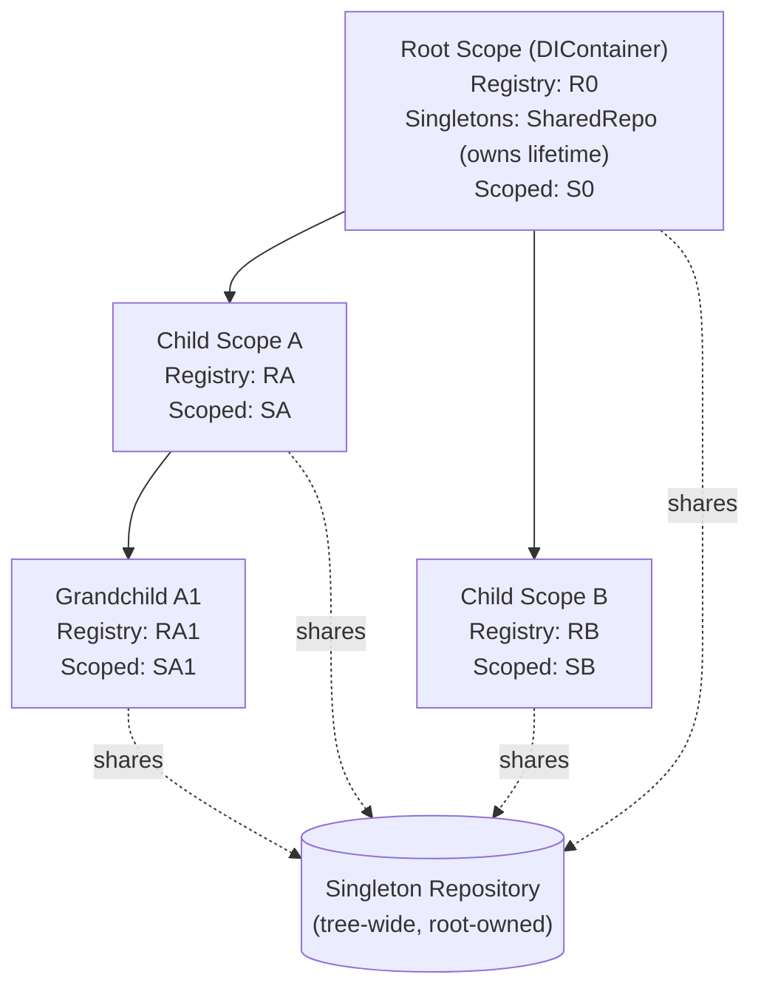
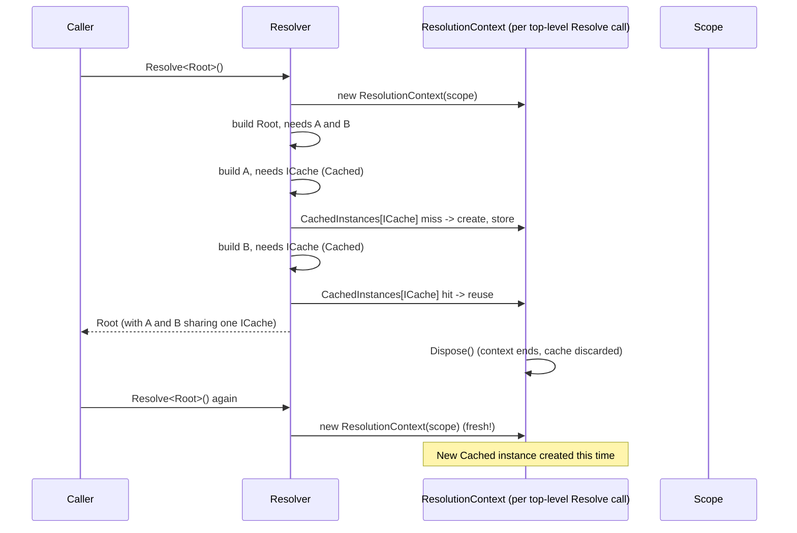

# Scopes, Lifetimes and Disposal

## Scope Tree Model

Every `DIContainer` owns exactly one root [`Scope`](../api/container-and-scope.md#iscope--scope). Calling `CreateScope()` on the root (or on any descendant) creates a new child `Scope` sharing the tree-wide `ScopeCreationConfig` (and therefore the same `IResolver`, `IScopeFactory`, `IRegistryFactory`, and — critically — the same `IRepositoryService` singleton store) but with its **own** `Registry` and `_scopedInstances` dictionary.



Registration lookups (`FindExactRegistration`, `FindOpenGenericRegistration`, `FindConditionalRegistration`) always search **from the current scope up towards the root**, so a child scope can resolve anything registered in itself or any ancestor, but a parent scope **cannot** see registrations made only in a child.

## Lifetime Semantics

| Lifetime | Where the instance is stored | Lookup key | Shared across | Example use case |
|---|---|---|---|---|
| `Transient` | Not stored for reuse — a new instance every resolution. | n/a | Nothing. | Lightweight, stateless, or mutable-per-use objects (e.g. a command object, a DTO builder). |
| `Singleton` | `IRepositoryService` (`RepositoryService`), owned by the **root** scope but referenced by every scope's `ScopeCreationConfig.SingletonRepository`. | `Type` (interface type). | The entire scope tree — root and all descendants resolve the **same** instance. | Configuration objects, caches, connection pools. |
| `Scoped` | Each `Scope`'s private `_scopedInstances` dictionary. | `Type` (interface type), scoped to `this` scope object instance. | Only within the exact scope that created it — child/parent/sibling scopes each get their own instance if they resolve the same type. | Per-request state (e.g., a "current user" context in a web request scope), a Unit-of-Work/DbContext per logical operation. |
| `Cached` | The current top-level `Resolve()` call's `ResolutionContext.CachedInstances` (a `ConcurrentDictionary<Type,object>`) — see [Registration and Resolution → `ResolutionContext`](../api/registration-resolution.md#resolutioncontext-internal). | `Type`, scoped to a **single `Resolve()` invocation's** entire dependency graph. | Only across dependencies resolved within one top-level `Resolve<T>()` call — e.g. if `A` and `B` both depend on `ICache`, and both are being constructed while resolving some root `X`, they get the same `ICache` instance; a subsequent, separate `Resolve<X>()` call gets a **new** `ICache` instance. | "One instance per object graph" semantics — e.g., avoiding redundant expensive computations shared by multiple branches of a single request's dependency tree, without the long-lived stickiness of `Scoped`/`Singleton`. |



## Existing-Instance Lookup (`Resolver.GetExistingInstance`)

```csharp
private object GetExistingInstance(Registration registration, Type interfaceType, ResolutionContext context)
{
    return registration.Lifetime switch
    {
        LifeTime.Singleton => registration.Instance ?? context.CurrentScope.GetSingleton(interfaceType),
        LifeTime.Scoped => context.CurrentScope.GetScoped(interfaceType),
        LifeTime.Cached => context.CachedInstances.TryGetValue(interfaceType, out object instance) ? instance : null,
        _ => null
    };
}
```

Note that `Transient` always falls to `_ => null` — i.e. never returns an existing instance, guaranteeing a fresh instance every time, even within the same `ResolutionContext`.

For `Singleton`, if the binding was created via `.ToInstance(...)`, `registration.Instance` is already populated and is returned directly without ever touching the scope's `_singletons` store (though `RegistryS.CreateRegistration` also forces `Lifetime = Singleton` for instance-bound registrations, so this path is consistent).

## Disposal

Each `Scope` owns its own `CleanupService`, which tracks every `IDisposable`/`IAsyncDisposable` instance created for `Transient`, `Cached`, and (also) `Scoped` lifetimes within that scope — actually, `Scoped` instances are tracked via `TrackDisposable` when stored (`StoreScoped` calls `TrackDisposable`), so scoped disposables are cleaned up when their owning scope is disposed. Singleton disposables are tracked separately, by the shared `IRepositoryService`, and are only released when the **root** scope is disposed.

```csharp
public void Dispose()
{
    if (_disposed) return;
    _disposed = true;

    lock (_scopedLock) { _scopedInstances.Clear(); }

    if (IsRoot)
    {
        lock (_singletons)
        {
            ((IDictionary)_singletons).Clear();
            _singletons.Dispose(); // disposes every tracked singleton
        }
    }
    else
    {
        Parent.RemoveChildren(this); // detach from the tree
    }

    _cleanupService.Dispose(); // disposes every tracked Transient/Cached/Scoped disposable in THIS scope
}
```

Important nuances:

- Disposing a **child** scope does **not** touch the singleton repository at all (only the root scope's `Dispose()` does), so singletons survive child-scope disposal, as expected.
- Disposing a **child** scope detaches it from its parent's `_childrens` list but does **not** recursively dispose its own children — if you create nested scopes, you are responsible for disposing them in the right order (typically innermost-first, e.g. via nested `using` blocks) or accept that undisposed grandchildren simply become unreachable garbage (their tracked disposables will not be explicitly disposed unless the GC happens to trigger finalizers, which SimplEnteiner does not rely on).
- `DisposeAsync()` mirrors `Dispose()` but awaits `_cleanupService.DisposeAsync()`, which prefers `IAsyncDisposable.DisposeAsync()` over `IDisposable.Dispose()` per tracked instance when both are implemented.
- The `OnRelease` callback (set via `.OnRelease(...)`) is invoked **before** the instance itself is disposed, for both the sync and async cleanup paths.

## Practical Example

```csharp
using DIContainer container = new DIContainer();

container.Bind<IAppConfig>().To<AppConfig>().AsSingle().Apply();
container.Bind<IRequestContext>().To<RequestContext>().AsScoped().Apply();
container.Bind<IGuidGenerator>().To<GuidGenerator>().AsCached().Apply();
container.Bind<ITransientWorker>().To<TransientWorker>().AsTransient().Apply();

container.Build();

using (IScope requestScope = container.CreateScope())
{
    var ctx1 = requestScope.Resolve<IRequestContext>();
    var ctx2 = requestScope.Resolve<IRequestContext>();
    // ctx1 == ctx2 (same Scoped instance within this scope)

    var config = requestScope.Resolve<IAppConfig>();
    // config is the SAME instance as container.Resolve<IAppConfig>() (Singleton, tree-wide)
} // requestScope disposed here: IRequestContext instance (if IDisposable) is disposed; IAppConfig is NOT

using (IScope anotherScope = container.CreateScope())
{
    var ctx3 = anotherScope.Resolve<IRequestContext>();
    // ctx3 != ctx1 (different scope => different Scoped instance)
}
```

Continue to [Decorators](./decorators.md).
