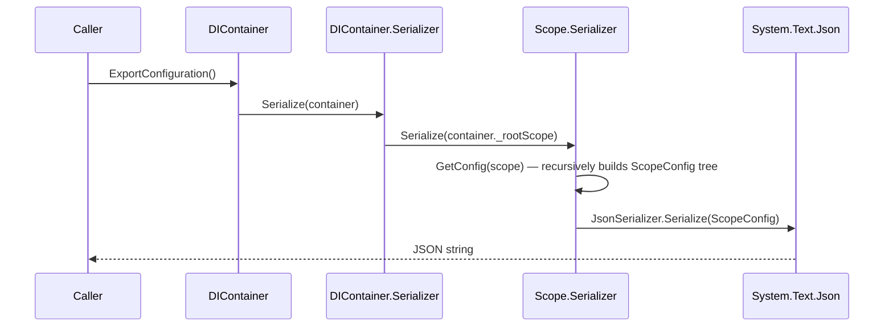

# Configuration Import/Export (Serialization)

SimplEnteiner can serialize the **structure** of a container's entire binding graph (exact, open-generic, conditional, and decorator bindings, recursively across all child scopes) to JSON, and later reconstruct a new `DIContainer` from that JSON.

Source: [`Core/Configuration/`](../../SimplEnteiner/Core/Configuration) (DTOs), `DIContainer.Serializer` and `Scope.Serializer` nested classes in [`DIContainer.cs`](../../SimplEnteiner/Core/DIContainer.cs) / [`Scope.cs`](../../SimplEnteiner/Core/ScopeFeature/Scope.cs).

## Public API

```csharp
public string ExportConfiguration();               // on DIContainer
public void ImportConfiguration(string jsonConfiguration); // on DIContainer
```

```csharp
DIContainer container = new DIContainer();
container.Bind<IGreeter>().To<Greeter>().AsSingle().Apply();
container.Build();

string json = container.ExportConfiguration();

DIContainer restored = new DIContainer();
restored.ImportConfiguration(json);
// restored now has the same bindings as container, freshly Build()-ed
```

## DTO Shapes

Source: [`Core/Configuration/BindingConfig.cs`](../../SimplEnteiner/Core/Configuration/BindingConfig.cs), [`DecoratorConfig.cs`](../../SimplEnteiner/Core/Configuration/DecoratorConfig.cs), [`ScopeConfig.cs`](../../SimplEnteiner/Core/Configuration/ScopeConfig.cs)

```csharp
[Serializable]
internal class BindingConfig
{
    public string InterfaceType { get; set; }      // AssemblyQualifiedName
    public string ImplementationType { get; set; } // AssemblyQualifiedName
    public string Lifetime { get; set; }            // LifeTime enum name
    public string InstanceJson { get; set; }         // JSON-serialized Instance (if any)
    public List<string> ArgumentsJson { get; set; }  // JSON-serialized Arguments
    public string Id { get; set; }                   // JSON-serialized Id (if any)
    public string Condition { get; set; }            // AssemblyQualifiedName of ConditionType (if any)
}

[Serializable]
internal class DecoratorConfig
{
    public string InterfaceType { get; set; }
    public string DecoratorType { get; set; }
    public int Order { get; set; }
    public string Lifetime { get; set; }
}

[Serializable]
internal class ScopeConfig
{
    public List<BindingConfig> ExactBindings = new();
    public List<BindingConfig> OpenGenericBindings = new();
    public List<DecoratorConfig> DecoratorBindings = new();
    public List<BindingConfig> ConditionalBindings = new();
    public List<ScopeConfig> Childrens = new();
}
```

All three DTOs are `internal` — not part of the public API surface — but understanding their shape is important for interpreting the exported JSON and for reasoning about round-trip fidelity.

## Serialization Flow



`GetConfig(Scope)` walks each registry bucket and converts every `Registration`/`DecoratorRegistration` into its DTO counterpart using `Type.AssemblyQualifiedName` for type references, and `JsonSerializer.Serialize(...)` for `Instance`/`Arguments`/`Id`. It then recurses into `scope._childrens` to serialize the whole scope tree.

## Deserialization Flow

```csharp
public void ImportConfiguration(string jsonConfiguration)
{
    _rootScope?.Dispose();
    _pendingBindings.Clear();

    _rootScope = new Scope(ConfigureConfig);
    _rootScope.InitializeFromDto(_serializer.DeserializeInternal(jsonConfiguration));
    Build();
}
```

`Scope.InitializeFromDto(ScopeConfig)` reconstructs registrations:

- **Exact / open-generic / conditional bindings**: `DeserializeRegistration` resolves `Type.GetType(bindingConfig.InterfaceType/ImplementationType)` and builds a new `Registration` with `Factory = null` — meaning **the compiled factory delegate is not restored**; it is `null` on the deserialized `Registration`. Any code path that would call `registration.Factory(parameters)` on such a registration (i.e., actually **resolving** it after import, when no live instance exists) would encounter a `null` factory. In practice, `Instance` is separately restored via `JsonSerializer.Deserialize(bindingConfig.InstanceJson, type)`, so instance-bound (effectively-singleton) bindings round-trip more usefully than factory/constructor-based ones.
- **Decorator bindings**: reconstructed with `Constructor = null` and `Factory = null` — the resolver's decorator-instantiation path (`CreateDecoratorInstance`) already has a fallback (`if (ctor == null || factory == null) { ctor = decorator.DecoratorType.GetInjectableConstructor(...); factory = ctor.GetFactoryMethod(); }`), so decorators **do** correctly regenerate their factory delegate lazily at first use after import — a subtle but important asymmetry with exact/open-generic/conditional bindings.
- **Child scopes**: recursively reconstructed via nested `ScopeConfig.Childrens`.

## Important Caveats

- **`Instance` round-trips via `System.Text.Json`**, which means only types compatible with `System.Text.Json`'s default serialization contract (public properties, parameterless constructor or supported constructor binding, no cycles, etc.) will survive export/import faithfully. Complex object graphs with private state, events, or unsupported types may lose data silently or throw during (de)serialization.
- **Non-instance, non-decorator registrations lose their compiled `Factory` on import** (see above) — this means a plain `Bind<T>().To<Impl>().AsTransient().Apply()`-style registration, after `ExportConfiguration()`/`ImportConfiguration()`, will have `Factory == null` on its restored `Registration`. Since `Resolver.ResolveRegistration` unconditionally calls `registration.Factory(parameters)` for these paths (no lazy-factory-regeneration fallback like decorators have), **resolving a non-instance exact/open-generic/conditional binding after `ImportConfiguration` will throw a `NullReferenceException`** unless that specific limitation is addressed by application code (e.g., re-registering critical bindings after import, or only relying on `ExportConfiguration`/`ImportConfiguration` for instance-bound / decorator-heavy configurations). Treat this feature as best-effort/experimental for anything beyond simple instance snapshots, and prefer explicit code-based composition roots for production dependency graphs.
- `OnActivation`/`OnRelease` callbacks are **not** serialized at all (delegates cannot be represented in JSON) — they are always `null` on deserialized registrations.
- `ConditionType`/`Id` on conditional bindings round-trip via `AssemblyQualifiedName` (for a `Type` condition) or `JsonSerializer.Deserialize<object>(...)` (for an arbitrary `id` object), with the deserialized `id`'s runtime type depending on how `System.Text.Json` infers `object`-typed values (numbers become `JsonElement`/boxed primitives depending on context) — exercise caution when using non-string ids together with export/import.

Continue to [Reachability Analysis and Validation](./reachability-analysis.md).
