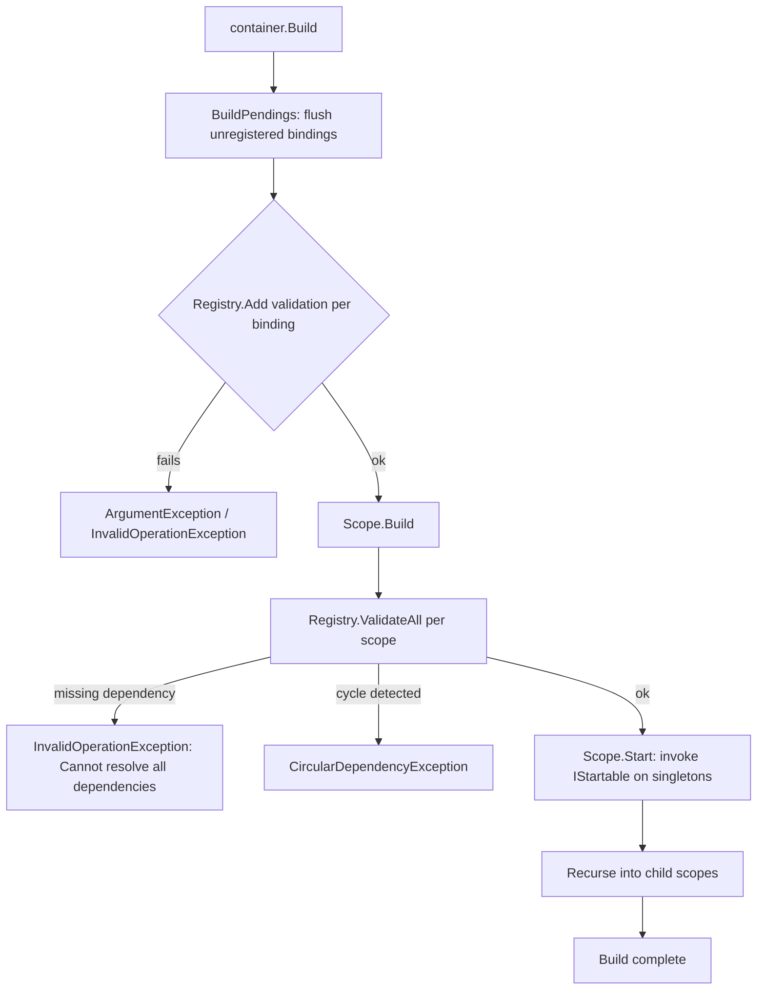

# Error Handling and Logging

## Exception Catalogue

SimplEnteiner does not define a large hierarchy of custom exception types. It relies primarily on standard BCL exceptions (`ArgumentNullException`, `ArgumentException`, `InvalidOperationException`) raised with descriptive messages, plus one custom exception type for circular dependencies.

| Exception | Thrown by | When |
|---|---|---|
| `ArgumentNullException` | `ThrowExtensions.ThrowIfArgumentNull<T>()` (used pervasively across `Binder`, `Resolver`, `ContainerExtensions`, `ConventionBuilder`, etc.) | Any required argument (interface `Type`, `BindingBuilder`, delegate callback, assembly, etc.) is `null`. Also thrown directly (not via the extension) in several `IBindingTo`/`IBindingTo<T>` implementations for `ToInstance`/`ToMethod` with `null` arguments, and throughout `TypeAnalyzes` public methods for `null` `type`/`assembly`/`parameter`/`member` arguments. |
| `InvalidOperationException` | `BindingBuilder.ThrowIfCantTransit<T>` | A binding builder stage is set out of order (e.g., calling `.AsSingle()` twice) — message format: `"{OperationName} already set!"` (e.g. `"Lifetime already set!"`). |
| `InvalidOperationException` | `Registry.ValidateAll()` | A registered exact binding's dependency graph cannot be fully resolved (missing binding for a non-concrete dependency), or an open-generic implementation is not concrete / lacks an injectable constructor. |
| `InvalidOperationException` | `Registry.AnalyzeReachability()` | Unreachable registrations and/or missing bindings for reachable non-concrete types were found (see [Reachability Analysis and Validation](./core/reachability-analysis.md)). |
| `InvalidOperationException` | `Resolver.GetRegistration` / `ResolveInternal` (via `ThrowInvalidIfNull`) | No binding can be found at all for a requested `interfaceType` (not concrete, no exact/open-generic/conditional registration). Message: `"No binding found for {interfaceType}"`. |
| `InvalidOperationException` | `Resolver.GetRegistration` (id path) | An explicit `.Resolve<T>(id)`/`.Resolve(Type, id)` call, or an `[Id(...)]`-attributed dependency, cannot find the requested conditional binding. Message includes the id: `"No binding found for {interfaceType} with id '{context.Id}'"`. |
| `InvalidOperationException` | `Scope.RegisterDecorator` | No injectable constructor exists for a registered decorator type. Message: `"No constructor for decorator {decoratorType}"`. |
| `InvalidOperationException` | `BindingDecorate.Validate` / `Registry.ValidateDecorator` | A decorator implementation is not compatible with (assignable to / constraint-satisfying / open-generic-implementing) the interface it decorates, or its constructor lacks a parameter assignable to the decorated interface. |
| `InvalidOperationException` | `SimplEnteinerServiceProvider.GetRequiredService` | `Resolve(serviceType)` returned `null` (see [MS.DI Integration API](./api/ms-di-integration.md)). |
| `ArgumentException` | `Registry.Validate` / `ValidateFirstStep` / `ValidateSecondStep` / `ValidateDecorator` | An implementation is not a concrete class, is not assignable to the target interface, does not satisfy closed/open generic constraints, or (for decorators) has no public constructor. |
| `ArgumentException` | `TypeAnalyzes.SatisfiesClosedGenericConstraints` | The supplied `closedGenericDefinition` argument is not actually a closed generic type (i.e., it's either non-generic or is itself an open generic definition). |
| `ArgumentException` | `ConventionBuilder.FromAssembly` | The same assembly is added twice via `FromAssembly`/`FromAssemblies`. |
| `Exception` (plain) | `TypeAnalyzes.GetInjectableConstructor` | More than one constructor on a type is marked with the inject attribute — message: `"Multiple constructors with {injectAttributeType.Name} attribute in {type}"`. Note: this is a plain `System.Exception`, not a more specific type — catch broadly or fix the offending type's constructors. |
| `TypeAnalyzes.CircularDependencyException` (`sealed`, extends `Exception`) | `TypeAnalyzes.CanResolveAllDependencies` (via `HasCyclicDependencies`) | A type's constructor/member dependency graph contains a cycle. Exposes `CircularPath` (`IReadOnlyList<Type>`) with the exact cycle, and a message like `"A cyclical dependency has been detected. Path: [ NamespaceA.TypeA -> NamespaceB.TypeB -> NamespaceA.TypeA ]"`. See [Attributes and Delegates → `CircularDependencyException`](./api/attributes-delegates.md#circulardependencyexception). |

## Error Handling Flow During `Build()`



Because `Build()` performs validation **before** starting any `IStartable` singletons, a configuration error anywhere in the graph prevents *any* startable singleton from running — there's no partial-startup state where some services are running and others failed validation.

## Best Practices for Handling Errors in Consuming Code

1. **Call `container.Build()` inside your application's startup path, not lazily.** Wrap it (or the whole composition-root method) so failures surface as clear, early, fatal startup errors rather than being discovered mid-request:

   ```csharp
   try
   {
       container.Build();
   }
   catch (TypeAnalyzes.CircularDependencyException ex)
   {
       // ex.CircularPath gives you the exact offending cycle for logging/diagnostics
       throw new ApplicationException($"DI cycle detected: {string.Join(" -> ", ex.CircularPath)}", ex);
   }
   catch (InvalidOperationException ex)
   {
       // Missing binding, decorator misconfiguration, etc.
       throw;
   }
   ```

2. **Use `AnalyzeReachability(...)` in a startup self-test or dedicated test**, not on every production boot if your registration graph is large enough that the O(n) walk matters (see [Performance and Optimization](./performance.md)) — though for most applications running it at every startup is perfectly fine and recommended.

3. **Do not rely on `GetService`-style `null`-on-miss semantics** when going through the [MS.DI integration](./api/ms-di-integration.md) — `SimplEnteinerServiceProvider.GetService` propagates SimplEnteiner's own `InvalidOperationException` for missing non-concrete bindings rather than returning `null`, which differs from some other `IServiceProvider` implementations. Use `try`/`catch` or pre-validate via `Build()`/`AnalyzeReachability` instead of relying on null-checks after `GetService`.

4. **Treat the plain `Exception` thrown by `GetInjectableConstructor`** (multiple `[Inject]`-marked constructors) as a compile-time-detectable class-authoring mistake — fix the offending type rather than catching this specific case at runtime.

5. **`OnRelease`/`OnActivation` callbacks should not throw.** Neither `CleanupService.Dispose()`/`DisposeAsync()` nor `Resolver.ResolveRegistration` wrap these callback invocations in `try`/`catch` — an exception thrown from an `OnRelease` callback during scope disposal will propagate out of `Dispose()`/`DisposeAsync()` and can prevent subsequent tracked instances in the same cleanup batch from being disposed (since the loop is not guarded). Keep these callbacks defensive.

## Logging

There is no built-in logging (`ILogger`, `Microsoft.Extensions.Logging`, `Console.Write*`, trace sources, or any other diagnostic output) anywhere in the SimplEnteiner codebase. All "log points" you might want (binding registered, instance activated/released, decorator applied) must be added by consumers via:

- `.OnActivation(instance => logger.LogDebug(...))` / `.OnRelease(instance => logger.LogDebug(...))` per binding.
- Implementing `IInitializable`/`IAsyncInitializable`/`IStartable` on your own types and logging from within those hooks.
- Wrapping services with a logging [decorator](./core/decorators.md).

See [Configuration and Settings → Logging Configuration](./configuration.md#logging-configuration) for the same conclusion from a configuration-surface perspective.

Continue to [Building and Deployment](./building-deployment.md).
